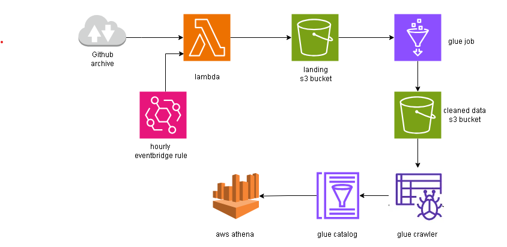

# AWS Glue ETL

## Overview
The user activity in github is being recorded and stored in an archive called GH Archive. The archive is being updated every hour with last 1 hour user activity data as json file. 
 
The requirement is to capture the data every hour  in s3 and process and store it in s3 in an optimzed way.

- In this project, I extracted the data from the web archive using aws lambda and store it in s3 and the lambda function is being triggered by eventbridge every hour. 
- A glue workflow is created with:
  
   1. On-demand trigger which triggers the glue job.
  
   2. The glue etl job reads the raw data from s3, cleans the data, partiton the data and writes into s3 in parquet format.
   
   3. On the completion of the glue job , a conditional-trigger will trigger a glue crawler to crawl the cleaned parquet files which will create the tables to be queried.
- Using athena the cleand data is being queried.

## Architecture


## Setup
To set up and deploy this solution, follow these steps:

1. **Clone this repository:**
    ```bash
    git clone https://github.com/Lashmanbala/aws_glue_etl.git
    ```
2. **Configure your AWS:**

   Configure your AWS credentials on your host machine to authenticate with AWS.
   
   And create a .env file like sample.env file with your values

3. **Create Lambda Function:**

   Create a lambda function in the aws console using the zipfile in the ghactivity downloader directory. And set the envronment variables in the lambda funtion.

4. **Create Eventbridge Rule:**

   Create an eventbridge rule to trigger the lambda function every hour in order to capture the hourly data.

6. **Install Required Packages:**
    ```bash
   cd aws_glue
   pip3 install -t requirements.txt
   ```
7. **Run The Script to deploy the glue app:**
   ```bash
   cd aws_glue
   python3 app.py
   ```  
8. **Run the script for Athena queries:**
   ```bash
   cd aws_glue
   python3 validate.py
   ```
   
## Contact
For any questions, issues, or suggestions, please feel free to contact the project maintainer:

GitHub: [Lashmanbala](https://github.com/Lashmanbala)

LinkedIn: [Lashmanbala](https://www.linkedin.com/in/lashmanbala/)
